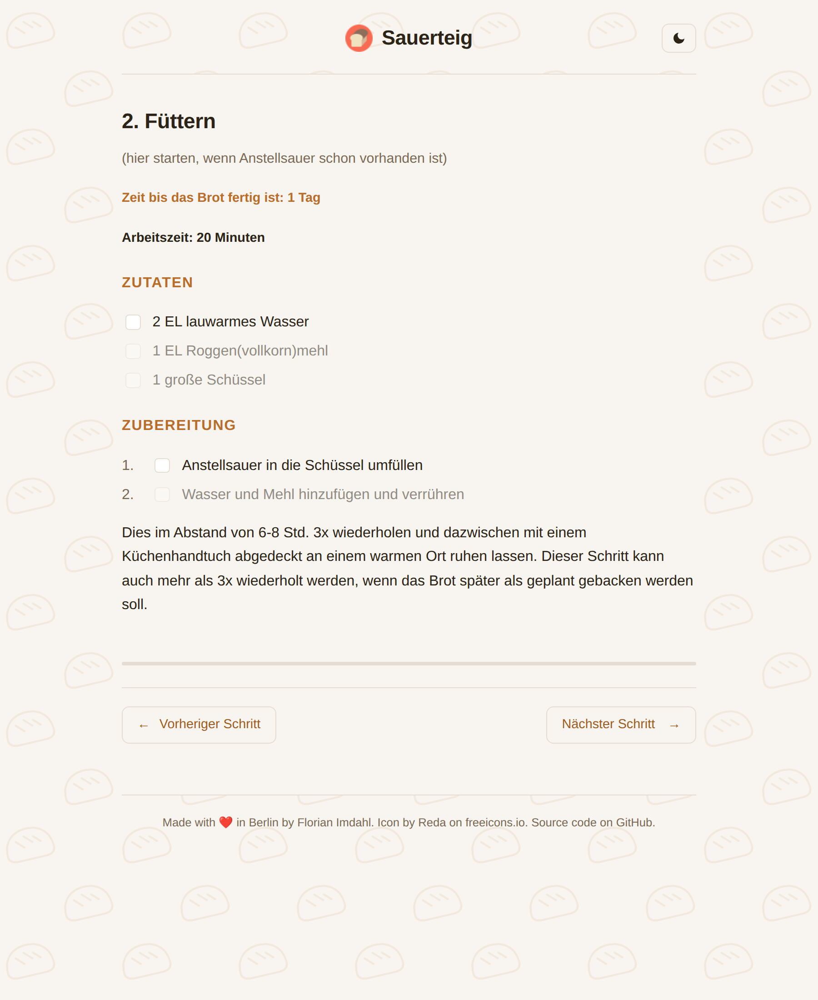

# sauerteig [](https://github.com/ffflorian/sauerteig/actions/)

Bake the best sour dough bread.

Sauerteig is an installable Progressive Web App that walks you through baking sourdough bread one step at a time. The recipe and all UI text are in German.

This is a monorepo with two packages: a React frontend (`packages/frontend`) and a NestJS backend (`packages/backend`) that handles scheduled push notifications.

## Features

- **Step-by-step guide**: six stages from the starter (Anstellsauer) to the finished loaf, with ingredients and instructions for each step.
- **Reminder timers**: start a countdown for any waiting period and get a browser notification when it expires - even hours or days later.
- **Light and dark theme**: follows your system preference and can be toggled manually; your choice is remembered.
- **Multiple navigation modes**: arrow keys, swipe gestures, and on-screen buttons.
- **Progress persistence**: your current step and running timers are stored in `localStorage`, so you can close the app and pick up where you left off.
- **Installable PWA**: add it to your home screen and use it offline-friendly.

## Screenshot



## Tech stack

React 19, TypeScript 6, Vite 8 (frontend) and NestJS, Mongoose, web-push (backend). See [AGENTS.md](AGENTS.md) for the full stack, project structure, and contribution conventions.

## Install

```
yarn
```

## Start

Frontend dev server at http://localhost:5173:

```
yarn workspace sauerteig-frontend start
```

Backend dev server at http://localhost:3000:

```
yarn workspace sauerteig-backend dev
```

## Build

Type-checks and bundles both packages:

```
yarn build
```

## Docker

Each package has its own Dockerfile.

```
docker build -f frontend.Dockerfile -t sauerteig-frontend .
docker run -p 8080:8080 sauerteig-frontend

docker build -f backend.Dockerfile -t sauerteig-backend .
docker run -p 3000:3000 sauerteig-backend
```

The frontend container exposes the app on port 8080 and provides a `/_health` endpoint.

## Recipe

The full recipe is also available as plain text in [Rezept.md](Rezept.md).

## License

[GPL-3.0](LICENSE)
